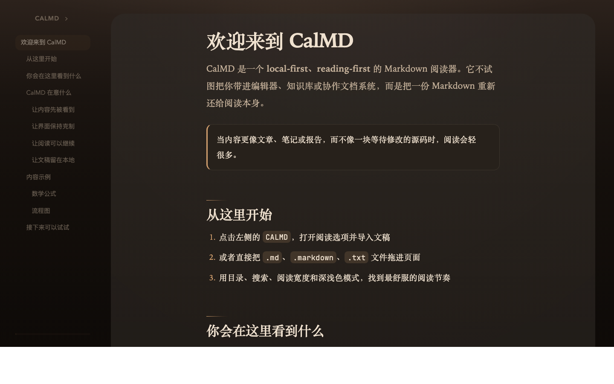

# CalMD

> 把 Markdown 当文章读，而不是当源码看。



CalMD 是一个 `local-first`、`reading-first` 的 Markdown 阅读器。它不强调编辑器能力，而是把重心放回阅读本身。

[在线体验](https://dozybot001.github.io/CalMD/) · [提交 Issue](https://github.com/dozybot001/CalMD/issues) · [贡献指南](./.github/CONTRIBUTING.md)

## 亮点

- 更适合长文的排版、宽度和阅读节奏
- 目录、搜索、阅读进度这些真正常用的辅助能力
- Mermaid、KaTeX、GFM 表格与任务列表开箱即用
- 最近文稿、阅读位置、主题偏好全部本地保存
- 不需要后端，不需要登录，不上传文稿内容

## 功能

- 支持 `.md`、`.markdown`、`.txt` 导入
- 阅读 / 源码双视图切换
- 目录导航、页内搜索、阅读进度
- Mermaid、KaTeX、GFM 表格与任务列表
- 记住最近文稿、阅读位置、主题和宽度设置
- 导出当前文稿为长图
- 全程本地处理，不依赖后端服务

## 快速开始

```bash
npm install
npm run dev
```

构建生产版本：

```bash
npm run build
npm run preview
```

## 环境要求

- Node.js `20+`
- npm `10+`

## 浏览器说明

- 推荐 Chrome / Edge
- Safari 和 Firefox 可使用大部分核心功能
- 通过系统“打开方式”直接打开 Markdown 文件依赖 File Handling API，目前仅 Chromium 系浏览器支持

## 开源协议

本项目使用 [MIT](./LICENSE) 许可证。
